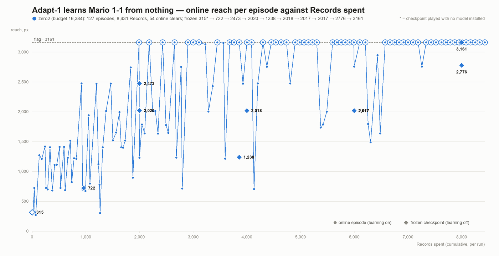

# Adapt-1 plays Super Mario Bros

[Adapt-1](https://docs.reilabs.org) (Rei Labs' NeuroAdapt API) learns to clear World 1-1 of the original Super Mario
Bros. This repo has three recipes that reach the flag, the code to rerun them, and the evidence from our runs.

It is a fork of [fhshaik/typesafe-mario](https://github.com/fhshaik/typesafe-mario): the emulator harness and the
state parser come from there. We replaced the model that picks the controls with Adapt-1 and added the learning loops,
datasets and evaluations.

## How it works

Adapt-1 never sees pixels. At each decision the harness sends a short row of numbers (Mario's speed, the floor ahead,
the nearest enemy, the height of the obstacle in front) to a **domain** — one learner on Adapt-1's server, with its own
rows and model — and gets back one of 8 macros, such as `right_run_jump_full`. After the game plays the macro out, the
harness reports how far Mario got, and the domain learns from that. The warm start begins from moves recorded from a
**scripted player** written by hand; the zero start begins from nothing.

**Machina**, Adapt-1's trajectory engine, works differently: it proposes the whole button sequence for an attempt at
once and improves on its best attempts.

## Results

Each result is a **frozen** evaluation: learning is switched off and Adapt-1 plays its best move. The flag is at x = 3161.

| recipe | idea | result on 1-1 | cost |
|---|---|---|---|
| [**Machina**](runs/machina/) | Adapt-1's trajectory engine proposes a whole button sequence per attempt and improves on its best attempts | first flag at attempt 403; the frozen replay clears 3/3 | ≈ 470 Records, 15 min |
| [**Warm start**](runs/warm-start/) | two Adapt-1 domains (when to jump; how to steer mid-air) learn from 1,017 rows recorded offline | clears 5/5 seeds | 1,017 Records |
| [**Zero start**](runs/zero-start/) | the same two domains start empty and learn only from their own play | clears after 8,000 Records of play | ≈ 8,500 Records, ≈ 16 h |



*Zero start: reach per episode (dots) and frozen checkpoints (diamonds) against Records spent.*

**Limits.** One level only: the 1-1 policies don't carry over to 2-1. Machina is deterministic and replays exactly. The
two domain recipes don't: the server refits its model as rows arrive, and the same rows can fit a policy that plays
differently. Machina sees Mario's position and learns one fixed sequence; the domain recipes see no position and react
to what's on screen.

## Run it

[`REPRODUCE.md`](REPRODUCE.md) has every command. The short version:

```bash
python3.13 -m venv .venv && . .venv/bin/activate
pip install -r requirements.lock.txt && pip install -e ".[mario,dev]"
pytest -q                                     # offline, no key
python scripts/pub/verify_runs.py runs        # check the evidence against its hashes
export REI_KEY=...                            # your Adapt-1 key, from app.reilabs.org/adapt-1
python scripts/machina_acquire.py --domain-id my-machina-1 --dry-run --attempts 3    # free rehearsal
```

Adapt-1 bills **Records** (each row or result you send) and **Queries** (each decision you ask for) separately.
Get a key and see your balance at [app.reilabs.org/adapt-1](https://app.reilabs.org/adapt-1).
Offline steps cost nothing. Coding agents: read [`AGENTS.md`](AGENTS.md) first.

## Layout

```
src/typesafe_mario/   harness, parser, features, Adapt-1 client (stdlib only), learning loops
scripts/              the commands in REPRODUCE.md; historical/ = an exact older generator the warm-start data needs
tests/                offline tests (no key, no network)
runs/                 the evidence: machina/, warm-start/, zero-start/stage-1..5/, each with a sha256 index
```

No Nintendo ROM or other game data is included (see [`NOTICE`](NOTICE)). Our code is MIT.
