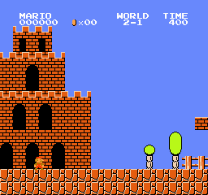
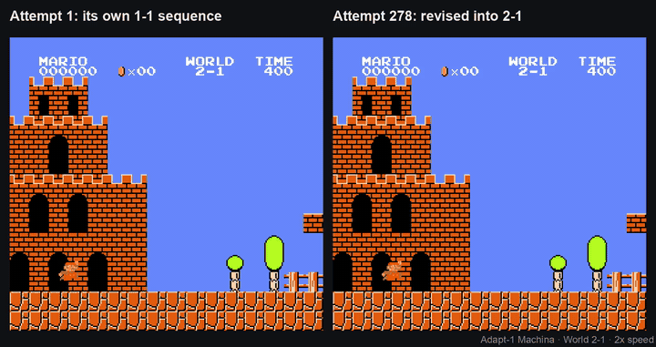

# Machina on 2-1, started from its own 1-1 sequence: first flag at attempt 278 (2026-10-03)

Run it: [`REPRODUCE.md` §3b](../../REPRODUCE.md#3b-machina-on-2-1--350-records) (≈ 350 Records).

Attempt 1 (Machina's own 1-1 sequence) beside attempt 278, at 2× speed:

Full-quality videos (download or open in the browser): [the frozen 2-1 replay with the command panel](videos/machina-2-1-frozen-clear.mp4)
(36 s) and [attempt 1 vs attempt 278](videos/before-after-attempt1-vs-278.mp4) (19 s). Both render offline from the
files here: `scripts/machina_dashboard.py` and `scripts/machina_before_after.py` (commands in [`REPRODUCE.md` §3b](../../REPRODUCE.md#3b-machina-on-2-1--350-records)).

Same engine, config and decoder as the [1-1 run](../machina/), on World 2-1. The first attempt does not use
Machina's proposal: it plays the sequence Machina found on 1-1 from zero (attempt 403 of that run), which reaches
x = 735 on 2-1 and dies at a piranha pipe. Machina then edits from there, like any other attempt. No demonstration,
no scripted player: the starting point is Machina's own earlier result.

| attempt | reach |
|---|---|
| 1 (the 1-1 sequence) | 735 |
| 5 | 1736 |
| 154 | 3026, the springboard under the 9-block tower |
| 170 | 3197: at the flagpole when the attempt ends (see below) |
| **278** | **flag** (x = 3193) |

- Flags: 33 of the 65 attempts from the first flag on. The run stops 64 attempts after the first flag.
- Frozen replay: **2-1 = 3193 flag on 3/3** (all 256 commands). The same sequence on 1-1 reaches 1262: one Machina
  sequence is one level.
- Cost: 1 Record per attempt (342) plus 2 to create and configure.

## Attempt 170 vs attempt 278

An attempt is at most **256 commands** of 8 frames (2,048 frames, about 34 s of game time). That is the longest
sequence Machina takes, so the harness stops the game there and scores what happened.

From attempt 170 on, Mario reaches the flagpole just as those 2,048 frames run out: he is in the air at the pole,
1 to 5 frames before the game registers the grab. Let the emulator run a few more frames and every one of those
attempts gets the flag (all 57 between 170 and 277, checked offline from the journal). So the level is
**effectively cleared at attempt 170**; **attempt 278** is the first attempt that grabs the pole within the 256
commands, the number we count.

How an attempt is scored: distance reached ÷ the flag's x (3193 on 2-1, 3161 on 1-1); a clear scores 1.0. An
attempt that ends in mid-air just past the pole's x (up to 3206) would score 1.004, more than a clear. In a first
run that is what happened: those near-misses outscored real clears, became Machina's best attempts, and it stopped
improving. The harness now caps an attempt without the flag at **0.995**, so a clear always scores highest; this
run used the cap from attempt 1. The cap changes nothing on 1-1 (no failed 1-1 attempt came within 690 px of the flag).

Machina was deterministic on 1-1 across two accounts. We have run this 2-1 setup once, so a rerun matching it
attempt for attempt is an expectation, not yet a result.

## Files

| file | what |
|---|---|
| `logs/mario-machina-2-1-seeded-b-2026*.jsonl.gz` | the full journal: resolved config, every proposal, execution and response |
| `logs/*-attempts.jsonl.gz` | one line per attempt: `max_x`, `flag`, `source`, `improved_parent` |
| `logs/*-frozen-*.jsonl.gz` | the frozen replays on 2-1 and 1-1 |
| `replays/seeded-b-278-first-flag.gif` | attempt 278, rendered offline from the journal (`machina_replay.py`) |
| `videos/` | the frozen 2-1 replay on the dashboard, and attempt 1 vs 278 (MP4, and the GIF above) |
| `*.provenance.json` | command, package versions, input hashes |
| `index.json` | sha256 of every file. The `session_id` values in the journals are blanked for publication |
